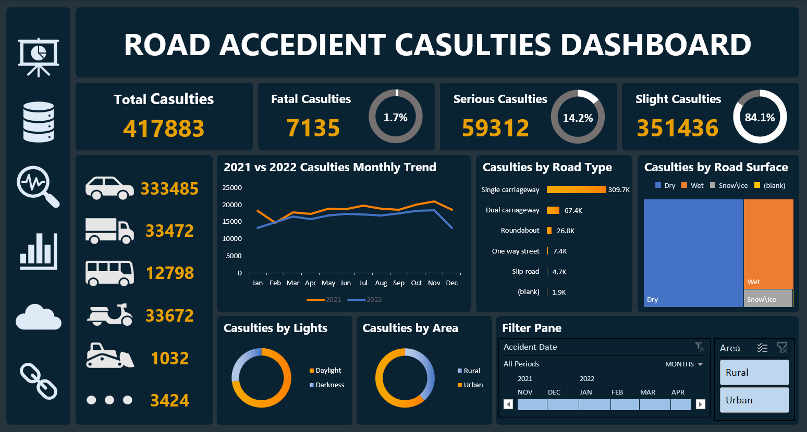

# Road Casualties Dashboard

## Overview
This dashboard analyzes road traffic accidents, highlighting key insights into vehicle types, accident severity, road surface conditions, and lighting factors. It aims to inform stakeholders and facilitate data-driven decisions for enhancing road safety and reducing casualties.

## Dataset Overview
The dataset contains information on 417,883 casualties from road traffic accidents, covering various vehicle types and accident severities. It includes key details such as accident severity, vehicle types involved, road surface conditions, junction types, lighting conditions, and the time and date of each accident.

## Insights and Visualizations
The dashboard includes the following:
- **KPIs**:
  - Vehicle Type Casualties (Cards)
  - Severity Distribution (Cards)
- **Monthly Trend of Casualties** (Line Chart)
- **Casualties by Road Type** (Bar Chart)
- **Casualties by Road Surface** (Area Chart)
- And many other visualizations

## Recommendations
Based on the analysis, the following recommendations can be drawn:
1. **Improve Road Safety in Urban Areas**: Urban areas account for the majority of casualties. Implementing stricter traffic regulations, better road signs, and enhanced pedestrian crossings could help reduce accidents. For example, **255,864 casualties** were recorded in urban areas.
2. **Focus on Single Carriageways**: Single carriageways see the highest number of casualties. Infrastructure improvements, such as better lane markings and wider lanes, could mitigate accident risks on these roads. Data shows **309.7K casualties** occurred on single carriageways.
3. **Target Safety Campaigns Around Wet Conditions**: With **115,261 casualties** happening in wet conditions, awareness campaigns about safe driving during adverse weather could significantly reduce accidents.

## Dashboard Preview


## Tools
- Excel for data analysis and visualization

## Repository Structure
```bash
├── data
│   └── road_data.xlsx
├── images
│   └── dashboard.png
└── README.md
